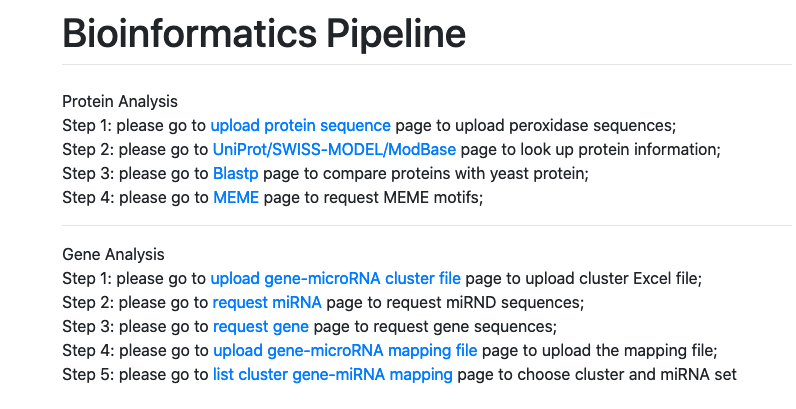

# Bioinformatics-Pipeline


# bio_scripts

This package contains multiple scripts to execute multiple bioinformatics jobs(MEME analysis, Blastp analysis, Multiple Sequence Alignment, Phylogenetic tree construction, etc). 
It reads the pending requests from external databases, and execute one request at a time.

# System diagram


# Web Application



## Gene Analysis Pipeline

cluster-base gene and miRNA files are uploaded and records are saved to database files. Gene fasta information are retrieved from UniProt, and miRNA fasta information are retrieved from http://www.mirbase.org/

In Step 5, user can make request based on cluster number and miRNA id for further MEME and MSA analysis. The request is stored into request_queue table in database.

On the server side, an adhoc or cron job will be run and check for outstanding requests, and handle by sequence one at a time. 

scripts/processMEME.py will retrieve cluster id and miRNA id from the requested json record, concatenate the fasta data of all mapped gene into one single file and run **[MEME][1]**

user can run **[MUCLE][2]** script to generate MSA(multiple squence alignment) and phylogenetic tree visualization.

```
./muscle3.8.31_i86darwin64 -in <input fastafile> -fastaout <fasta out> -clwout <clw output file>
```

The generated phylogenetic tree file can be uploaded and visualized in **[iTOL web site][3]**

[1]: https://saket-choudhary.me/moca/
[2]: https://www.drive5.com/muscle/
[3]: https://itol.embl.de/
    