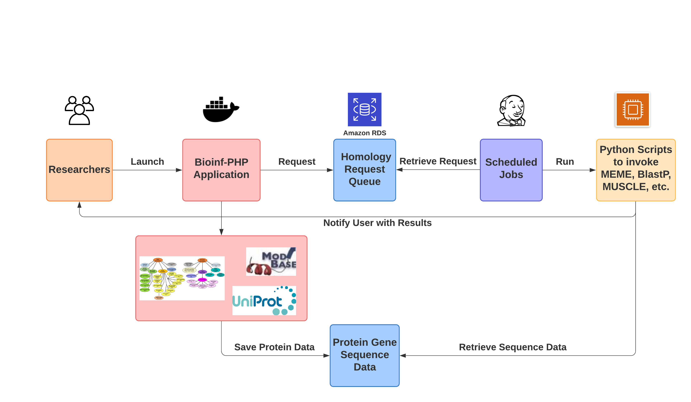

# Bioinformatics-Pipeline


# bio_scripts

This package contains multiple scripts to execute multiple bioinformatics jobs(MEME analysis, Blastp analysis, Multiple Sequence Alignment, Phylogenetic tree construction, etc). 
It reads the pending requests from external databases, and execute one request at a time.

# System diagram


# Task 1: setup CRONTAB for process various jobs

# Task 2: setup EMAIL server to send script result files in emails
    ```
    ## install mail tools on server (https://github.com/kootenpv/yagmail)
    pip install keyring
    pip install yagmail


    run the following to register gmail account:
    import yagmail
    yagmail.register('mygmailusername', 'mygmailpassword')
    ```